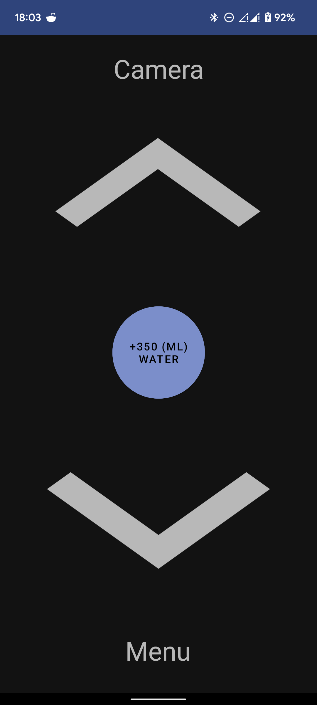
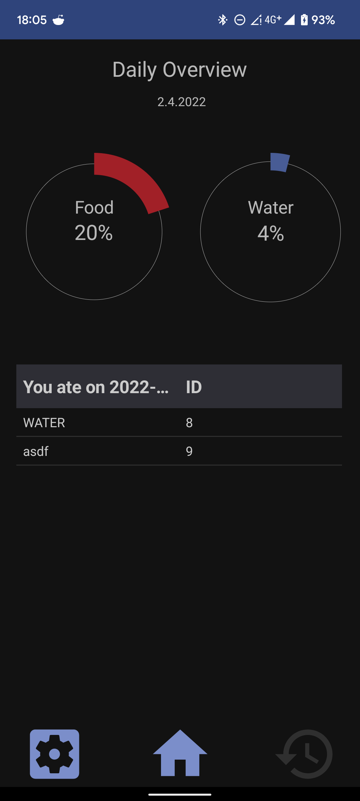
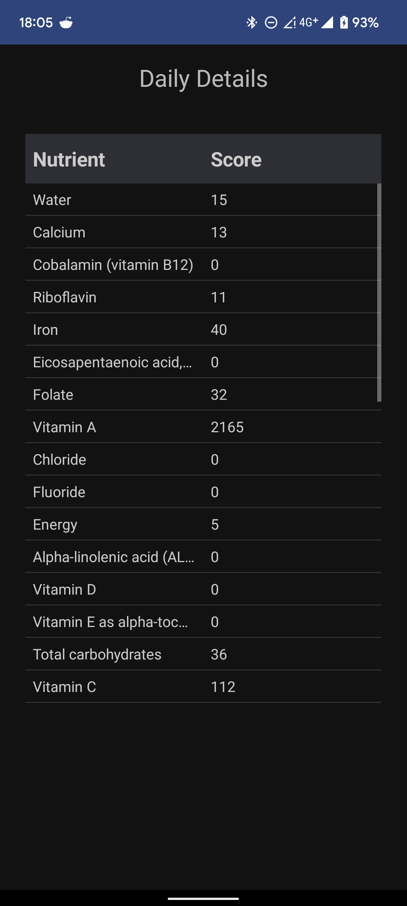
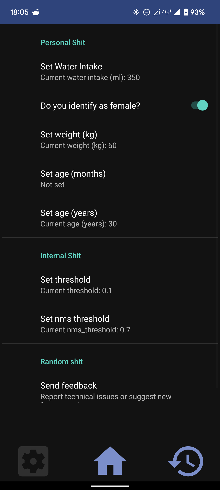
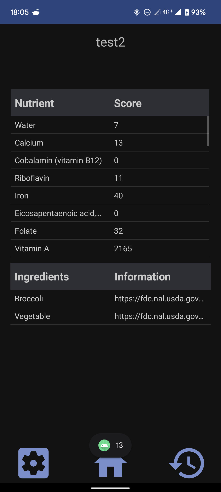
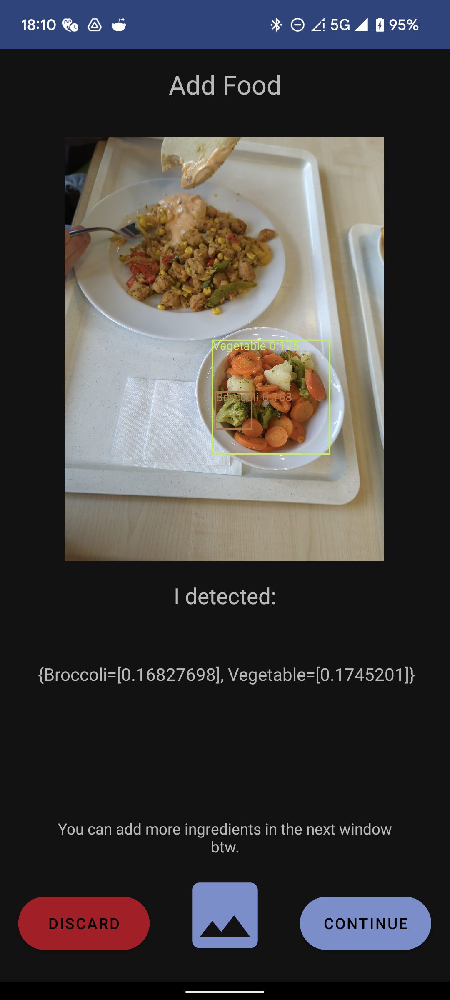
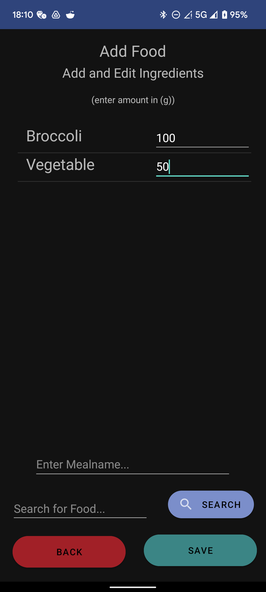

# send NUTEZ - Food Tracking done right.

## About
send NUTEZ is a food tracking app with automatic food detection from images and personalized nutrition scores for your daily food and water intake. The daily nutrition reference values are based on the [EFSA-references](https://multimedia.efsa.europa.eu/drvs/index.htm) and are calculated based on your personal settings. Nutrition facts are queried from the [FoodData central](https://fdc.nal.usda.gov/) API. The detection is working offline and user-specific data is saved locally on the device. The food detection is based on an existing [Food recognition](https://github.com/lannguyen0910/food-recognition) implementation based on the [ultralytics YOLOv5s](https://github.com/ultralytics/yolov5) and pre-trained weights for different food converted to work with the [NCNN Framework](https://github.com/Tencent/ncnn).

This app is the result of a one-week practical from the chair of [Embedded Intelligence for Health Care and Wellbeing ](https://www.uni-augsburg.de/en/fakultaet/fai/informatik/prof/eihw/). The app was mainly tested on a Google Pixel 6 (Android 12) and Sony Xperia Z5 (Android 7.1.2).

## Features
+ personalized daily nutrition/water scores
+ realtime offline food detection (with decent performance)
+ detailed nutrition scores for each day and meals
+ nutrition data history for past days
+ intake reference calculation personalisation
+ add food from the food database manually

## Screenshots

## Installation
+ Clone the repo and import it to Android Studio
+ Make sure to have [Cmake](https://cmake.org/) and [Ninja](https://ninja-build.org/) installed
+ Build via Gradle
+ Deploy on your device via Android Studio

## Known Issues
+ Deletion of meals, ingredients etc.
+ Janky Food score
+ Fitness value not calculated in score
+ Food detection not reliable
+ Food detection preview and box overlay resolution differences on some devices

## Extensions
+ Recipe (API) suggestions based on your nutrition intakes
+ Barcode Detection
+ Better food detection model
+ Select a more performant model based on device performance
+ Use the originally planned, different food recognition algorithm approach
+ Even more detailed statistics
+ (cannibal mode if the camer detects a human)

## Credits
+ https://multimedia.efsa.europa.eu/drvs/index.htm -> nutrition references
+ https://fdc.nal.usda.gov/ -> nutrition database
+ https://github.com/lannguyen0910/food-recognition -> yolov5 food implementation
  + https://github.com/Tencent/ncnn
  + https://github.com/ultralytics/yolov5
+ https://arxiv.org/abs/1909.05994 -> real time food recognition implementation
